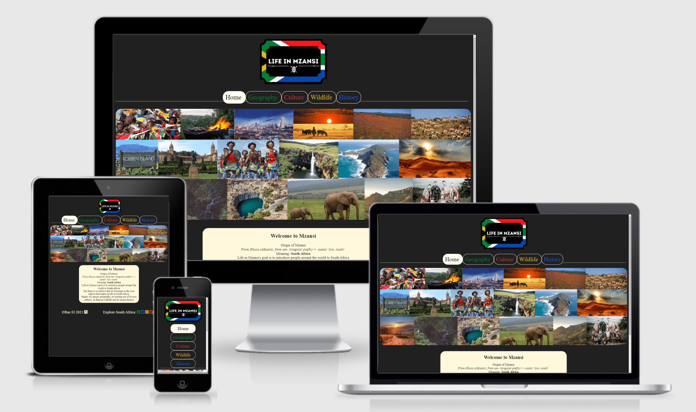
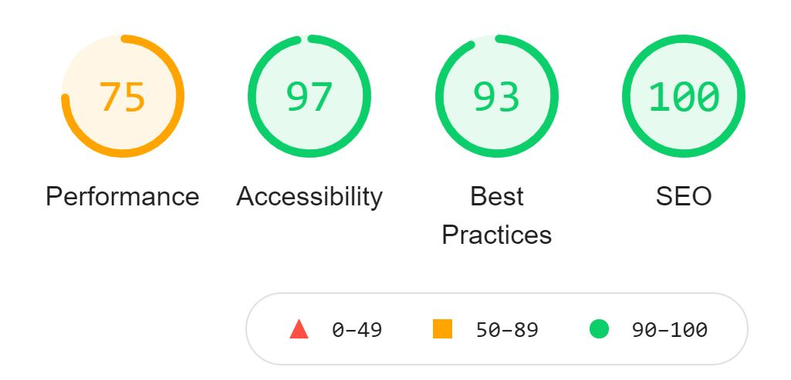
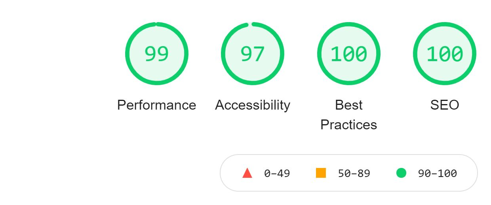
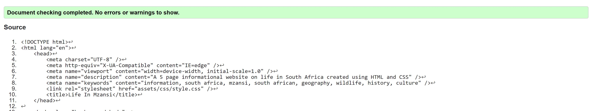
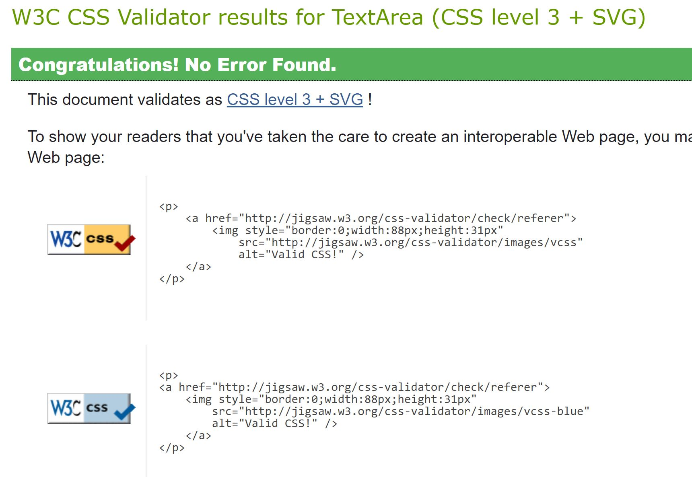

# Life in Mzansi

## Tabel of contents
- <a href="#overview1">Overvew</a>
  - <a href="#overview2">What is this website for?</a>
  - <a href="#overview3">What does it do?</a>
  - <a href="#overview4">How does it work?</a>
- <a href="#features1">Features</a>
  - <a href="#features2">Existing Features</a>
  - <a href="#features3">Features Left to Implement</a>
- <a href="#tech">Technologies Used</a>
  - <a href="#tech1">Frameworks Libraries and Programmes Used</a>
- <a href="#test1">Testing</a>
  - <a href="#test2">Lighthouse Testing</a>
  - <a href="#test3">Validator Testing</a>
- <a href="#deployment">Deployment</a>
- <a href="#credit1">Credits</a>
  - <a href="#credit2">Code</a>
  - <a href="#credit3">Media</a>
  - <a href="#credit4">Acknowledgments</a>

<h2 id="overview1">Overview</h2>

<h3 id="overview2"> What is this website for?</h3>

Life in Mzansi is a website that aims to provide information about life in South Africa. This site will be targeted towards anyone with an interest in learning about South Africa, its geography, cultures, wildlife and history.

<h3 id="overview3"> What does it do?</h3>

Life in Mzansi has several pages of information that briefly outline what life in South Africa is like. There also links to external websites that can help expand on certain topics. It does this by focusing on the four main pillars of life in South Africa, namely Culture, Wildlife, History and Geography. Users will have a decent knowledge of South Africa by the time they are done with the website. 

<h3 id="overview4">How does it work?</h3>

Life in Mzansi was created with HTML5 and styled with CSS3. There are 5 pages in total that are navigated using the menu located at the top of the website beneath the website logo. This project was developed on Gitpod and deployed on Github. The site can viewed [here](https://raeel97.github.io/life-in-mzansi/)

<h2 id="features1">Features</h2>

<h3 id="features2">Existing Features</h3>

- A stylish front page with a hero image and short introduction that explains the purpose of the website and the reason behind its naming. 
- A logo that links to the home page. The logo incorporates the South African flag.
- The website incorporate the colors of the South African flag to add to the user experience, this can be seen in the headings of each page, the buttons of the menu, the borders around each image and the external links in the footer. 
The body of the website is black and each page is styled to represent one of the 5 other colors present in the South African flag. The home page is white, geography page is green, culture page is red, wildlife page is yellow and the history page is blue.   
- A page dedicated to South African [geography](https://raeel97.github.io/life-in-mzansi/geography.html).
- A page dedicated to South African [culture](https://raeel97.github.io/life-in-mzansi/culture.html).
- A page dedicated to South African [wildlife](https://raeel97.github.io/life-in-mzansi/wildlife.html).
- A page dedicated to South African [history](https://raeel97.github.io/life-in-mzansi/history.html).
- A horizontally centered menu is used to navigate the website. Each menu buttons colors invert when selected.
- A footer with links to the South African Tourism's facebook, twitter, instagram and youtube pages. The links have been styled to appear as the external websites logos and keeping with the theme, the south african flag colors were used. There is also a link to the developers github profile. 

<h3 id="features3">Features Left to Implement</h3>
- The wildlife page will be split into 2 further pages, mainly a flora and fauna page. 
- A contact form will be later added so that users can submit feedback and get into contact with the developer.
- An interactive map of South Africa will be added below the hero image that links to pages about each province. 
- The hero image will be replaced with a carousel gallery. 

 
 
<h2 id="tech">Technologies Used</h2>
<h3 id="tech1">Languages Used</h3>
<ul>
<li>HTML</li>
<li>CSS</li>

</ul>

<h3 id="tech2">Frameworks Libraries and Programmes Used</h3> 
<ul>
<li><a href="https://fontawesome.com/" target="_blank">Font Awesome</a> - used for icons.</li>
<li><a href="https://fonts.google.com/" target="_blank">Google Fonts</a> - to import the font-family used in the website: Lato.</li>
<li><a href="https://github.com/" target="_blank">GitHub</a> - used to host repository.</li>
<li><a href="https://www.gitpod.io/" target="_blank">GitPod</a> - used to develop project and organise version control.</li>
<li><a href="https://pages.github.com/" target="_blank">GitHub Pages</a> - used to deploy the site.</li>
<li><a href="https://developers.google.com/web/tools/lighthouse" target="_blank">Lighthouse</a> - for performance review.</li>
</ul>

<h2 id="test1">Testing</h2>

<h3 id="test2">Lighthouse Testing</h3>
- Code was written using Gitpod and tested using Chrome Devtools Lighthouse:   

Mobile lighthouse report
 

 Desktop lighthouse report
  
- All code used on the site has been tested to ensure everything is working as expected
- Site viewed and tested in the following browsers:
  - Google Chrome
  - Microsoft Edge
  - Mozilla Firefox

 

<h3 id="test3">Validator Testing</h3>
- HTML was validated using [W3C Validator](https://validator.w3.org/)

 HTML Validator report
  
- CSS was validated using [W3C Jigsaw Validator](https://jigsaw.w3.org/css-validator/)

 CSS Validator report
  

<h2 id="deployment">Deployment</h2>

The website was deployed to github pages through the following steps:
<ol>
<li>Navigate to github in the browser.</li>
<li>Sign in with user credentials.</li>
<li>Navigate to repositories.</li>
<li>Select the repository to deploy.</li>
<li>Select settings from the menu bar.</li>
<li>Scroll to Github Pages section.</li>
<li>Select Master branch from source drop down.</li>
<li>Click Save</li>
<li>Refresh page.</li>

</ol>

Github pages will now deploy the site automatically and update any changes pushed to the master branch.
<h2 id="credit1">Credits</h2> 
<h3 id="credit2">Code</h3>
<ul>
<li>Most of the code was utilized from lessons given by the Code Institute</li>
<li>StackOverflow was used when problems were encountered</li>
<li>W3Schools was used as reference material</li>
</ul>
<h3 id="credit3">Media</h3>
Credits for all images and text content can be found 
<a href="https://docs.google.com/document/d/1tdvjpFs-6x18K_DlkTxnTTpyp8QGxtCw6KemXN8DQ9o/edit?usp=sharing">here</a>.
  
<h3 id="credit4">Acknowledgments</h3>
I would like to thank my mentor, my student advisor, the slack community and all tutor and support staff at Code Institute for their guidance and assistance in the making of this project. 
